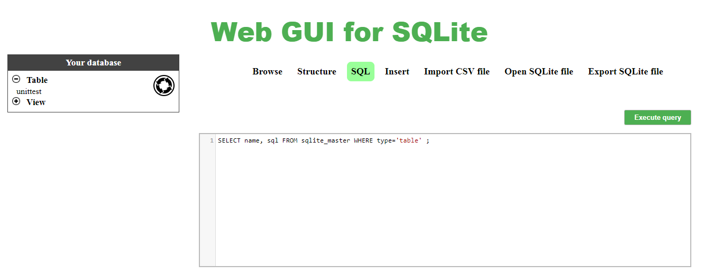

# Web GUI for SQLite 

Web GUI for SQLite is a web-based SQLite browser written in JavaScript.

This tool is still basic and needs to be improved.

Try the demo here: [https://extendsclass.com/sqlite-browser.html](https://extendsclass.com/sqlite-browser.html)

## Dependencies 

This tool required:
 * [a11y-dialog](https://github.com/edenspiekermann/a11y-dialog) (MIT license)
 * [codeMirror](https://github.com/codemirror/CodeMirror) (MIT license)
 * [sql.js](https://github.com/kripken/sql.js/) (MIT license)
 * [github corners](https://github.com/tholman/github-corners) (MIT license)

## Install

Drop the files into a directory (on a server or on your PC) and then visit in a browser. 

## Launch tests

Update config.js file with the path of your installation.

You must install packages:
npm install

Finally, runs the tests:
npm run test

## License

MIT
